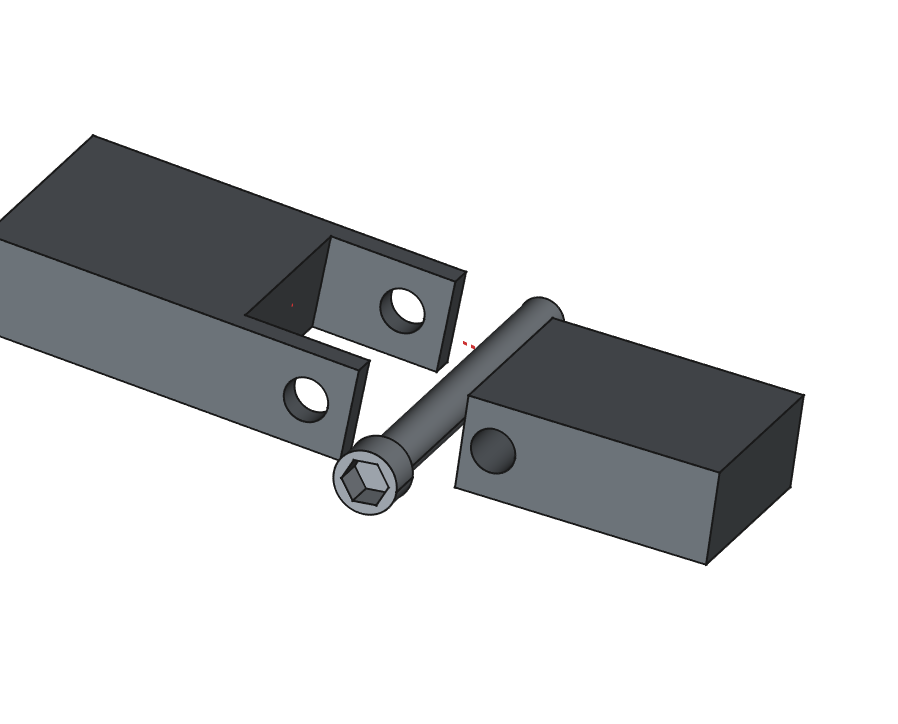

# Charnière avec axe à assembler
_Dernière modification: 04/04/2025_

## Représentation simplifiée

Comme l'axe est assemblé, il peut être dans un autre type de matériau, comme en métal et donc augmenter la résistance de la charnière.

## Analyse de l'orientation d'impression
Impression verticale est optimale, mais peut également être imprimé horizontalement.

## Evaluation qualitative de la résistance aux contraintes
TBD

## Spécifications de jeu
| Orientation                       | Jeu  | Résultats expérimentaux           |
| --------------------------------- | -----| ------------------ |
| Orientation horizontale de l'axe  | TBD  | Jeu libre |
| Orientation verticale de l'axe  | TBD  | Jeu libre |

## Paramètres d'impression

| Différentes impressions           | Imprimante             | Filament      | Profil           |
| --------------------------------- | ---------------------- | ------------- | ------------- |
| Orientation horizontale de l'axe  | MK4 input shaper 0.4mm | Prusament PLA | 0.20mm Speed  |

## Conseils d'optimisation de conception
- Ajouter une pointe à l'alésage (pièce femelle) afin d'éviter un effondrement dû au porte-à-faux (overhang).

## Citations - Sources - Attribution
Non applicable
