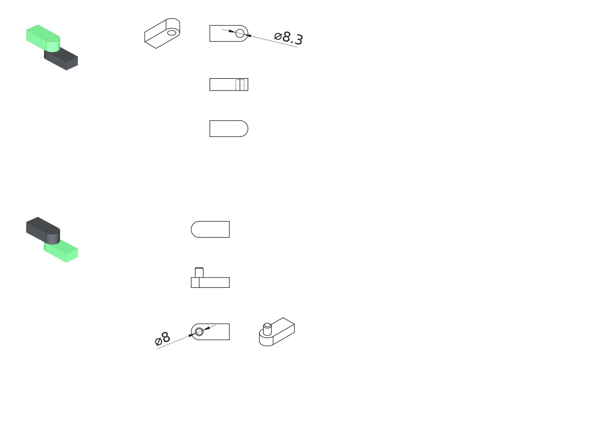
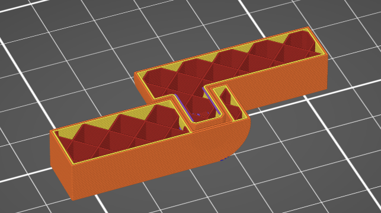
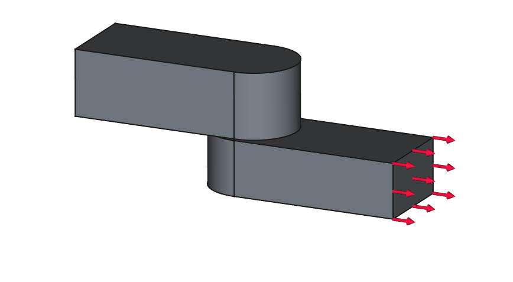
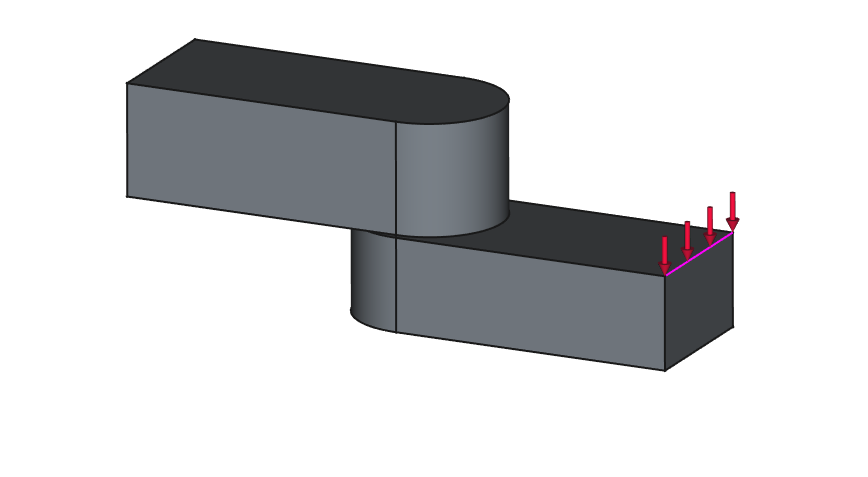

# Charnière universelle simple et détachable
_Dernière modification: 24/03/2025_

## Explication
Une charnière simple détachable est un composant mécanique constitué de deux parties imbriquées pouvant pivoter l'une par rapport à l'autre autour d'un axe commun. Ce type de charnière permet la rotation selon une direction mais peut facilement se détacher lorsqu'une force est appliquée dans d'autres directions, ce qui la rend adaptée aux applications nécessitant un assemblage/désassemblage rapide mais avec une capacité de charge limitée.

## Dessins

[Modèle FreeCad](./hinge-rotation-simple.FCStd) | [Modèle Step](./hinge-rotation-simple.step)

## Analyse de l'orientation d'impression
### Orientation horizontale de l'axe de rotation
__Avantages__ : Résistance plus élevée à la traction et la flexion.

__Inconvénients__ : Lignes de couche visibles sur les surfaces courbes, les tolérances sont moins précises.

### Orientation verticale de l'axe de rotation
__Avantages__ : Surfaces de rotation plus lisses.

__Inconvénients__ : Risque de délamination des couches sous charge, structure globale plus faible en raison de l'orientation des couches.

## Evaluation qualitative de la résistance aux contraintes
*Effort 1*

*Effort 2*

| Orientation                       | Effort 1          | Effort 2           |
| --------------------------------- | ----------------- | ------------------ |
| Orientation verticale de l'axe    | Résistance faible | Résistance faible  |
| Orientation horizontale de l'axe  | Resistance haute  | Resistance moyenne |

## Spécifications de jeu
| Orientation                       | Jeu          | Résultats expérimentaux           |
| --------------------------------- | ----------------- | ------------------ |
| Orientation verticale de l'axe    | 0.15 | Jeu libre  |
| Orientation horizontale de l'axe  | 0.15  | Friction moyenne |

## Paramètres d'impression

| Différentes impressions           | Imprimante             | Filament      | Profil           |
| --------------------------------- | ---------------------- | ------------- | ------------- |
| Orientation verticale de l'axe    | MK4 input shaper 0.4mm | Prusament PLA | 0.20mm Speed |
| Orientation horizontale de l'axe  | MK4 input shaper 0.4mm | Prusament PLA | 0.20mm Speed  |

## Conseils d'optimisation de conception
- Augmenter le diamètre de l'axe pour une plus grande résistance.
- Ajouter un méplat sur l'axe/pivot pour faciliter le pont (bridging)

- Ajouter une pointe à l'alésage (pièce femelle) afin d'éviter un effondrement dû au porte-à-faux (overhang).

- Ajouter un chanfrein à la base du pivot augmente la résistance de la pièce.

## Citations - Sources - Attribution
Pas d'application
