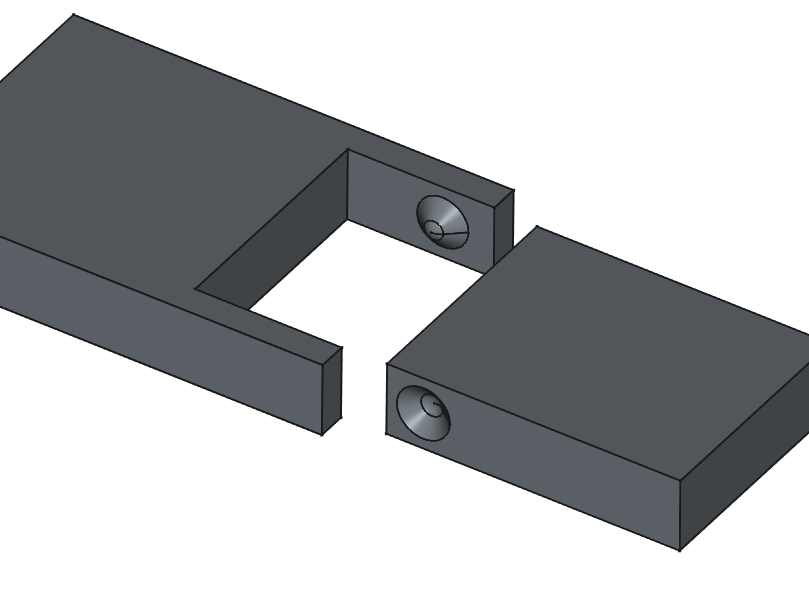

# Charnière pivot conique emboitable
_Dernière modification: 24/03/2025_

## Représentation simplifiée

Cette charnière avec des pivots coniques possède un peu plus de jeu que sa contrepartie avec des [cylindres](./snap-strong.md). Cependant le jeu est plus faible qu'on pourrait le penser. Les deux parties peuvent se désassembler sans endommager la charnière.

## Analyse de l'orientation d'impression
Impression verticale à réaliser

## Evaluation qualitative de la résistance aux contraintes
TBD

## Spécifications de jeu
| Orientation                       | Jeu  | Résultats expérimentaux           |
| --------------------------------- | -----| ------------------ |
| Orientation horizontale de l'axe  | 0.3  | Jeu libre |

## Paramètres d'impression

| Différentes impressions           | Imprimante             | Filament      | Profil           |
| --------------------------------- | ---------------------- | ------------- | ------------- |
| Orientation horizontale de l'axe  | MK4 input shaper 0.4mm | Prusament PLA | 0.20mm Speed  |

## Conseils d'optimisation de conception

## Citations - Sources - Attribution
Vu sur la chaine Youtube de MakerMuse [[Youtube](https://youtu.be/fbY7xHGaeNM?si=pbwtnPVgYeoj8QsR&t=240)]
