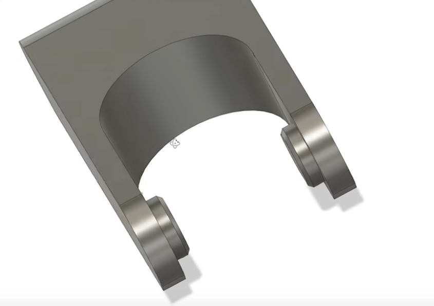

# Charnière à emboiter
_Dernière modification: 24/03/2025_

_MakerMuse_

Une version alternative qui supporte plus d'effort de traction est également présentée, mais plus difficile à emboiter.

_MakerMuse_

## Citations - Sources - Attribution
Vu sur la chaine Youtube de MakerMuse [[Youtube](https://youtu.be/fbY7xHGaeNM?si=pbwtnPVgYeoj8QsR&t=240)]
