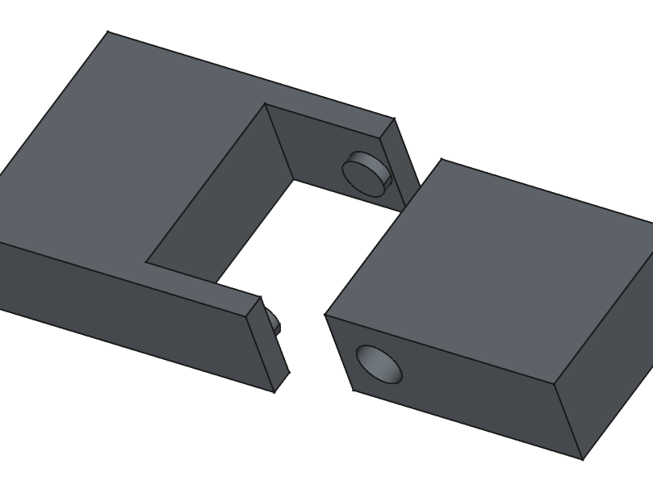

# Charnière pivots courts cylindriques (emboitable)
_Dernière modification: 24/03/2025_

Afin de rendre le système emboitable, il est nécessaire de rendre les pattes de fixation flexible en diminuant leur épaisseur, mais cela réduira la résistance à la traction. Il peut être plus judicieux si les parties doivent se désassembler d'utiliser la [charnière à pivot conique emboitable](./snap-clip.md).

## Analyse de l'orientation d'impression
Impression verticale à réaliser

## Evaluation qualitative de la résistance aux contraintes
TBD

## Spécifications de jeu
| Orientation                       | Jeu          | Résultats expérimentaux           |
| --------------------------------- | ----------------- | ------------------ |
| Orientation horizontale de l'axe  | 0.3  | Jeu libre |

## Paramètres d'impression

| Différentes impressions           | Imprimante             | Filament      | Profil           |
| --------------------------------- | ---------------------- | ------------- | ------------- |
| Orientation horizontale de l'axe  | MK4 input shaper 0.4mm | Prusament PLA | 0.20mm Speed  |

## Conseils d'optimisation de conception
- Augmenter le diamètre du pivot pour une plus grande résistance.
- Ajouter un chanfrein à 45° sur la base du pivot court afin d'éviter le porte-à-faux lors de l'impression.

- Ajouter une pointe à l'alésage (pièce femelle) afin d'éviter un effondrement dû au porte-à-faux (overhang).

- Ajouter un chanfrein à la base du pivot augmente la résistance de la pièce. Le chanfrein du pivot devrait être plus petit que celui de l'alésage afin de minimiser la friction dans la charnière.

## Citations - Sources - Attribution
Vu sur la chaine Youtube de MakerMuse [[Youtube](https://youtu.be/fbY7xHGaeNM?si=pbwtnPVgYeoj8QsR&t=240)]
